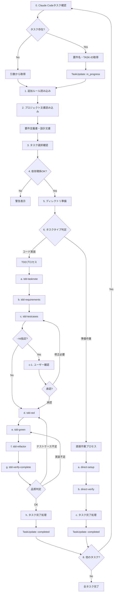

あなたは実装担当者です。残タスクを調べて 指定されたコマンドを駆使して実装をしてください

# kairo-implement

## 目的

分割されたタスクを順番に、またはユーザが指定したタスクを実装する。既存のTDDコマンドを活用して品質の高い実装を行う。

## オプション

- `--hil` (Human-in-the-Loop): テストケース作成後にユーザーの確認を求め、承認後にtdd-red以降のフェーズを実行する
- `--model [defaultModel]` タスク内で利用する最優先のデフォルトのモデルを指定する。設定がない場合はauto(それぞれのデフォルトを優先) sonnet/opusなどの指定が可能
- `--think-model [thinkModelName]`: requirements/testcasesのモデル名を指定。デフォルトは opus
- `--tdd-model [tddModelName]`: red/green/refactor/verify-complete のモデル名を指定。デフォルトはsonnet
- `--note-model [noteModelName]`: tasknote のモデル名を指定。デフォルトはhaiku

## 前提条件

- `docs/tasks/{要件名}-tasks.md` にタスク一覧が存在する
- ユーザがタスクの実装を承認している
- 既存のTDDコマンドが利用可能である
- 実装用のワークスペースが設定されている
- task_id は　`TASK-{4桁の数字}` (例 TASK-0001 ) である
- thinkTaskName を コマンド選択ルール で設定する。 thinkModelName , defaultModel, `opus`
- tddTaskName を コマンド選択ルール で設定する。 tddModelName , defaultModel, `sonnet`
- noteTaskName を コマンド選択ルール で設定する。 noteModelName , defaultModel, `haiku`

## コマンド選択ルール

### パラメータ
- selectModel
- defaultModel
- commandDefaultModel

### ルール

selectModel は　(selectModel == null && defaultModel != null) の場合、 defaultModel
selectModel は　(selectModel == null && defaultModel == null) の場合、 commandDefaultModel

この時点で selectModel が null の場合は sonnetにする

selectModelに
- `sonnet` が指定されている場合は `sonnet` を返す
- `opus` が指定されている場合は `opus` を返す
- `haiku` が指定されている場合は `haiku` を返す

## 実行内容

**【信頼性レベル指示】**:
各項目について、元の資料（EARS要件定義書・設計文書含む）との照合状況を以下の信号でコメントしてください：

- 🔵 **青信号**: EARS要件定義書・設計文書を参考にしてほぼ推測していない場合
- 🟡 **黄信号**: EARS要件定義書・設計文書から妥当な推測の場合
- 🔴 **赤信号**: EARS要件定義書・設計文書にない推測の場合

0. **Claude Codeタスクシステムの確認**
   - TaskList ツールで未完了のタスク（pending/in_progress）を確認
   - タスクのsubjectが "TASK-" で始まるものを抽出
   - 各タスクについて：
     - TaskGet でタスクの詳細情報を取得
     - metadata から以下を取得：
       - `requirement_name`: 要件名
       - `task_file`: タスクファイルパス（例: docs/tasks/db-migration-tool/TASK-0001.md）
       - `phase`: フェーズ情報
       - `task_type`: タスクタイプ（TDD/DIRECT）
   - 引数の優先順位：
     - **引数で要件名が指定されている場合**: 引数の要件名を使用
     - **引数で要件名が省略されている場合**: Claude Codeタスクのmetadataから要件名を取得
     - **TASK-IDの決定**:
       - 引数でTASK-IDが指定されている場合: 引数のTASK-IDを使用
       - 引数でTASK-IDが省略されている場合:
         - blockedByが空（依存タスクがない）かつstatus=pendingの最初のタスクを選択
         - 選択したタスクのsubjectからTASK-IDを抽出（例: "TASK-0001: タスク名" → TASK-0001）
   - 選択したClaude CodeタスクのIDを記録（後でステータス更新に使用）

1. **追加ルールの読み込み**
   - `docs/spec/{要件名}/note.md` が存在する場合は読み込み

2. **プロジェクト文書の読み込み**

   - **タスク関連文書の読み込み**:
     - `docs/tasks/{要件名}/overview.md` or `docs/tasks/{要件名}-overview.md` - タスク全体概要
     - `docs/tasks/{要件名}/TASK-{task_id}.md` or `docs/tasks/{要件名}-tasks.md` - 対象タスクファイル
     - 依存タスクのファイルも読み込み、実装の順序と関連性を理解
     - Claude Codeタスクのmetadataにtask_fileがある場合はそのパスを優先使用

3. **タスクの選択と実行開始**
   - 選択されたタスクの詳細を表示
   - Claude Codeタスクが選択されている場合:
     - TaskUpdate でステータスを 'in_progress' に更新
     - 更新内容を表示: "📌 Claude Codeタスク #{task_id} を実行中に設定しました"
   - 読み込んだ技術スタック定義に基づいて実装方針を決定

4. **依存関係の確認**
   - Claude CodeタスクのblockedByフィールドを確認
   - 依存タスクが完了しているか確認（status=completed）
   - 未完了の依存タスクがある場合は警告
   - Task tool (subagent_type: Explore, thoroughness: quick) を使用して依存タスクファイルの状態も確認

5. **実装ディレクトリの準備**
   - 現在のワークスペースで作業を行う
   - 必要に応じてディレクトリ構造を確認

6. **実装タイプの判定**
   - タスクの性質を分析（コード実装 vs 準備作業）
   - 実装方式を決定（TDD vs 直接作業）
   - Claude Codeタスクのmetadata.task_typeも参考にする

7. **実装プロセスの実行**

   ### A. **TDDプロセス**（コード実装タスク用）

   a. **コンテキスト準備** - `@Task tool (subagent_type: general-purpose, model: {{noteTaskName}}) /tsumiki:tdd-tasknote`
   ```
   Task実行: TDDコンテキスト準備フェーズ
   目的: タスクノートを生成し、開発に必要なコンテキスト情報を収集する
   収集内容:
   - 技術スタック（使用技術・フレームワーク・アーキテクチャパターン）
   - 開発ルール（コーディング規約・型チェック・テスト要件）
   - 関連実装（既存の実装パターン・参考コード）
   - 設計文書（データモデル・ディレクトリ構造）
   - 注意事項（技術的制約・セキュリティ要件・パフォーマンス要件）
   コマンド: /tsumiki:tdd-tasknote {要件名} {TASK-ID}
   実行方式: 個別Task実行
   出力ファイル: docs/implements/{要件名}/{TASK-ID}/note.md
   ```

   b. **要件定義** - `@Task tool (subagent_type: general-purpose, model: {{thinkTaskName}}) /tsumiki:tdd-requirements`
   ```
   Task実行: TDD要件定義フェーズ
   目的: タスクの詳細要件を記述し、受け入れ基準を明確化する
   前提条件: タスクノート（note.md）が存在すること
   コマンド: /tsumiki:tdd-requirements {要件名} {TASK-ID}
   実行方式: 個別Task実行
   ```

   c. **テストケース作成** - `@Task tool (subagent_type: general-purpose, model: {{thinkTaskName}}) /tsumiki:tdd-testcases`
   ```
   Task実行: TDDテストケース作成フェーズ
   目的: 単体テストケースを作成し、エッジケースを考慮する
   コマンド: /tsumiki:tdd-testcases
   実行方式: 個別Task実行
   ```

   c-1. **ユーザー確認** (--hilオプション指定時のみ)
   ```
   テストケース確認フェーズ:
   - 作成されたテストケース一覧を表示
   - テストケースの妥当性をユーザーに確認
   - ユーザーからのフィードバックを受け取る
   - 必要に応じてテストケースを修正
   - 承認後、d. tdd-red以降のフェーズを実行

   確認内容:
   - テストケースが要件を満たしているか
   - エッジケース・エラーケースが十分か
   - テストケースの数と粒度が適切か
   - 追加・修正が必要なテストケースはないか
   ```

   d. **テスト実装** - `@Task tool (subagent_type: general-purpose, model: {{tddTaskName}}) /tsumiki:tdd-red`
   ```
   Task実行: TDDレッドフェーズ
   目的: 失敗するテストを実装し、テストが失敗することを確認する
   コマンド: /tsumiki:tdd-red
   実行方式: 個別Task実行
   ```

   e. **最小実装** - `@Task tool (subagent_type: general-purpose, model: {{tddTaskName}}) /tsumiki:tdd-green`
   ```
   Task実行: TDDグリーンフェーズ
   目的: テストが通る最小限の実装を行い、過度な実装を避ける
   コマンド: /tsumiki:tdd-green
   実行方式: 個別Task実行
   ```

   f. **リファクタリング** - `@Task tool (subagent_type: general-purpose, model: {{tddTaskName}}) /tsumiki:tdd-refactor`
   ```
   Task実行: TDDリファクタリングフェーズ
   目的: コードの品質向上と保守性の改善を行う
   コマンド: /tsumiki:tdd-refactor
   実行方式: 個別Task実行
   ```

   g. **品質確認** - `@Task tool (subagent_type: general-purpose, model: {{tddTaskName}}) /tsumiki:tdd-verify-complete`
   ```
   Task実行: TDD品質確認フェーズ
   目的: 実装の完成度とテストケースの充足度を確認する
   確認項目:
   - すべてのテストケースが実装されているか
   - すべてのテストケースが成功しているか
   - テストカバレッジが要求水準を満たしているか
   - エッジケースがすべてカバーされているか

   判定基準:
   - テストケースが不足している場合: d(tdd-red)から繰り返す
   - テストケースは十分だが実装が不足している場合: e(tdd-green)から繰り返す
   - 実装・テストともに十分な場合: 次のステップ（h. タスク完了処理）へ

   コマンド: /tsumiki:tdd-verify-complete
   実行方式: 個別Task実行
   ```

   h. **タスク完了処理**
   ```
   品質確認が成功した後の処理:
   - タスクファイルの完了チェックボックスを更新
   - Claude Codeタスクシステムの更新:
     - TaskUpdate でステータスを 'completed' に更新
     - 更新結果を表示: "✅ Claude Codeタスク #{task_id} を完了に設定しました"
   - 実装サマリーの作成
   - 次のタスクの提案（依存関係が解消された次のタスク）
   ```

   ### B. **直接作業プロセス**（準備作業タスク用）

   a. **準備作業の実行** - `@Task tool (subagent_type: general-purpose, model: {{tddTaskName}}) /tsumiki:direct-setup`
   ```
   Task実行: 直接作業実行フェーズ
   目的: ディレクトリ作成、設定ファイル作成、依存関係のインストール、環境設定を行う
   作業内容:
   - ディレクトリ作成
   - 設定ファイル作成
   - 依存関係のインストール
   - 環境設定
   実行方式: 個別Task実行
   ```

   b. **作業結果の確認** - `@Task tool (subagent_type: general-purpose, model: {{tddTaskName}}) /tsumiki:direct-verify`
   ```
   Task実行: 直接作業確認フェーズ
   目的: 作業完了の検証と成果物確認を行う
   作業内容:
   - 作業完了の検証
   - 期待された成果物の確認
   - 次のタスクへの準備状況確認
   実行方式: 個別Task実行
   ```

   c. **タスク完了処理**
   ```
   作業確認が成功した後の処理:
   - タスクファイルの完了チェックボックスを更新
   - Claude Codeタスクシステムの更新:
     - TaskUpdate でステータスを 'completed' に更新
     - 更新結果を表示: "✅ Claude Codeタスク #{task_id} を完了に設定しました"
   - 実装サマリーの作成
   - 次のタスクの提案（依存関係が解消された次のタスク）
   ```

7. **全体の完了確認**
   - タスクのステータスを更新（タスクファイルのチェックボックスにチェックを入れる）
   - Claude Codeタスクシステムの更新:
     - TaskUpdate でステータスを 'completed' に更新
     - 依存関係が解消された次のタスクを TaskList で確認
   - 実装結果をドキュメント化
   - 次のタスクを提案（Claude Codeタスクの依存関係を考慮）

## 実行フロー



## コマンド実行例

```bash
# 全タスクを順番に実装
$ /tsumiki:kairo-implement {要件名}

# 特定のタスクを実装
$ /tsumiki:kairo-implement {要件名} TASK-0001

# Human-in-the-Loopモードで実装（テストケース作成後に確認）
$ /tsumiki:kairo-implement {要件名} TASK-0001 --hil

# Human-in-the-Loopモードで全タスクを実装
$ /tsumiki:kairo-implement {要件名} --hil

# Claude Codeタスクシステムと連携（引数省略）
# - 未完了のClaude Codeタスクから自動的に要件名とTASK-IDを取得
# - タスク開始時にステータスを in_progress に更新
# - タスク完了時にステータスを completed に更新
$ /tsumiki:kairo-implement

# Claude Codeタスクシステムと連携（要件名のみ指定）
# - 指定した要件名のClaude Codeタスクから最初の未完了タスクを選択
$ /tsumiki:kairo-implement {要件名}
```

## 実装タイプ判定基準

### TDDプロセス（コード実装タスク）

以下の条件に当てはまるタスク：

- 新しいコンポーネント、サービス、フック等の実装
- 既存コードの機能追加・修正
- ビジネスロジックの実装
- API実装

**例**: TaskService実装、UIコンポーネント作成、状態管理実装

### 直接作業プロセス（準備作業タスク）

以下の条件に当てはまるタスク：

- プロジェクト初期化・環境構築
- ディレクトリ構造作成
- 設定ファイル作成・更新
- 依存関係のインストール
- ツール設定・設定

**例**: プロジェクト初期化、データベース設定、開発環境設定

## 個別Task実行アプローチ

### Task実行の方針

各実装ステップを個別のTaskとして実行することで、以下のメリットが得られます：

1. **独立性**: 各ステップが独立して実行され、エラー発生時の切り分けが容易
2. **再実行性**: 特定のステップのみ再実行が可能
3. **並列性**: 依存関係のないステップは並列実行可能
4. **追跡性**: 各ステップの実行状況と結果が明確に記録される

### Task実行パターン

```bash
# TDDプロセスの場合
@Task tool (subagent_type: general-purpose, model: {{noteTaskName}}) /tsumiki:tdd-tasknote {要件名} {TASK-ID}
@Task tool (subagent_type: general-purpose, model: {{thinkTaskName}}) /tsumiki:tdd-requirements {要件名} {TASK-ID}
@Task tool (subagent_type: general-purpose, model: {{thinkTaskName}}) /tsumiki:tdd-testcases {要件名} {TASK-ID}
@Task tool (subagent_type: general-purpose, model: {{tddTaskName}}) /tsumiki:tdd-red {要件名} {TASK-ID}
@Task tool (subagent_type: general-purpose, model: {{tddTaskName}}) /tsumiki:tdd-green {要件名} {TASK-ID}
@Task tool (subagent_type: general-purpose, model: {{tddTaskName}}) /tsumiki:tdd-refactor {要件名} {TASK-ID}
@Task tool (subagent_type: general-purpose, model: {{tddTaskName}}) /tsumiki:tdd-verify-complete {要件名} {TASK-ID}

# 直接作業プロセスの場合
@Task tool (subagent_type: general-purpose, model: {{tddTaskName}}) /tsumiki:direct-setup {要件名} {TASK-ID}
@Task tool (subagent_type: general-purpose, model: {{tddTaskName}}) /tsumiki:direct-verify {要件名} {TASK-ID}
```

## 実装時の注意事項

### 全般

1. **Claude Codeタスクシステム連携**
   - 実行開始時に TaskList で未完了タスクを確認
   - タスク開始時に TaskUpdate でステータスを 'in_progress' に更新
   - タスク完了時に TaskUpdate でステータスを 'completed' に更新
   - metadata から要件名、タスクファイルパス、タイプを取得
   - 引数が省略された場合は Claude Codeタスクの情報を使用
   - 依存関係（blockedBy）を考慮して次のタスクを提案

2. **プロジェクト文書の活用**
   - 要件定義書（EARS記法）を常に参照し、実装の根拠を明確にする
   - 設計文書に記載されたアーキテクチャ、データフロー、API仕様に従う
   - タスクファイルの「関連文書」セクションから必要な文書を確認
   - 信頼性レベル（🔵🟡🔴）を参考に、推測が必要な箇所を特定

3. **ファイル構造の理解**
   - `docs/spec/{要件名}/` - 要件定義書
   - `docs/design/{要件名}/` - 設計文書
   - `docs/tasks/{要件名}/` - タスク管理
   - 各タスクファイルには依存関係と関連文書へのリンクが含まれる

### TDDプロセス用

4. **--hilオプション使用時の注意**
   - テストケース作成後、必ずユーザーの確認を待つ
   - ユーザーが承認するまでtdd-red以降のフェーズを実行しない
   - 修正指示があった場合は、tdd-testcasesフェーズから再実行
   - AskUserQuestion ツールを使用してユーザーの選択を取得

5. **テストファースト**
   - 必ずテストを先に書く
   - テストが失敗することを確認してから実装

6. **インクリメンタルな実装**
   - 一度に全てを実装しない
   - 小さなステップで進める

7. **品質確認の徹底**
   - 各ステップで品質を確認
   - 技術的負債を作らない
   - **テストケース充足度の確認**:
     - すべての要件に対してテストケースが存在するか
     - エッジケース、エラーケース、境界値テストが含まれているか
     - テストカバレッジが基準を満たしているか（目安: 80%以上）
   - **実装完成度の確認**:
     - すべてのテストケースが成功しているか
     - 要件定義書・設計文書に記載された仕様を満たしているか
     - コード品質（可読性、保守性）が基準を満たしているか

8. **品質確認後の対応**
   - テストケース不足の場合:
     - d. tdd-red に戻り、不足しているテストケースを追加
     - e. tdd-green で実装を追加
     - f. tdd-refactor でリファクタリング
     - g. tdd-verify-complete で再確認
   - 実装不足の場合（テストケースは十分）:
     - e. tdd-green に戻り、失敗しているテストを通す実装を追加
     - f. tdd-refactor でリファクタリング
     - g. tdd-verify-complete で再確認

9. **Human-in-the-Loop実行フロー**
   - --hilオプション指定時:
     1. c. tdd-testcases でテストケースを作成
     2. c-1. 作成されたテストケースの一覧と分析結果を表示
     3. AskUserQuestionツールでユーザーの選択を取得:
        - 「承認」: d. tdd-red以降のフェーズを続行
        - 「修正」: ユーザーの指示に基づいてテストケースを修正後、c-1に戻る
        - 「キャンセル」: 実装を中断し、現在の状態を保存
     4. 承認後、通常のTDDプロセスを続行

### 直接作業プロセス用

10. **作業の段階的実行**
    - 依存関係を考慮した順序で実行
    - 各ステップの完了を確認

11. **設定の検証**
    - 作成した設定ファイルの動作確認
    - 環境の正常性チェック

12. **ドキュメントの更新**
    - 実装と同時にドキュメントも更新
    - 他の開発者が理解できるように

## 出力フォーマット

### タスク開始時（TDDプロセス）

```
🚀 タスク {{task_id}}: {{task_name}} の実装を開始します

📋 タスク詳細:
- 要件: REQ-101, REQ-102
- 依存: {{依存タスクID}} ✅
- 推定時間: 4時間
- 実装タイプ: TDDプロセス
- Claude Codeタスク: #{{claude_task_id}} (in_progress)

🔄 TDDプロセスを開始します...
```

### タスク開始時（直接作業プロセス）

```
🚀 タスク {{task_id}}: {{task_name}} の実装を開始します

📋 タスク詳細:
- 要件: REQ-402, REQ-006
- 依存: {{依存タスクID}} ✅
- 推定時間: 3時間
- 実装タイプ: 直接作業プロセス
- Claude Codeタスク: #{{claude_task_id}} (in_progress)

🔧 準備作業を開始します...
```

### 各ステップ完了時（TDD）

```
✅ Task 1/8: @task /tsumiki:tdd-tasknote 完了
   ファイル: docs/implements/{要件名}/{{task_id}}/note.md
   Task実行結果: タスクノート作成完了

✅ Task 2/8: @task /tsumiki:tdd-requirements 完了
   ファイル: docs/implements/{要件名}/{{task_id}}/{要件名}-requirements.md
   Task実行結果: 要件定義書作成完了

🏃 Task 3/8: @task /tsumiki:tdd-testcases 実行中...
   Task実行: TDDテストケース作成フェーズを開始

...

✅ Task 7/8: @task /tsumiki:tdd-verify-complete 完了
   品質確認結果:
   - テストケース充足度: 95% (26/27件実装済み)
   - テストケース成功率: 92% (24/26件成功)
   - テストカバレッジ: 88%

   判定: テストケース不足あり & 実装不足あり
   → Task 4/8 (tdd-red) から再実行します

🏃 Task 4/8: @task /tsumiki:tdd-red 実行中...
   不足しているテストケースを追加します
```

### ユーザー確認時（--hilオプション指定時）

```
✅ Task 3/8: @task /tsumiki:tdd-testcases 完了
   ファイル: docs/implements/{要件名}/{{task_id}}/testcases.md

📋 作成されたテストケース (27個):

【正常系テストケース】
1. ✓ 有効なタスクIDでタスクが正常に作成できる
2. ✓ 必須フィールドが全て設定された状態でタスクが作成できる
3. ✓ オプションフィールドを省略してもタスクが作成できる
...

【異常系テストケース】
15. ✓ 無効なタスクID形式でエラーが返される
16. ✓ 必須フィールド不足でバリデーションエラーが返される
17. ✓ 重複するタスクIDでエラーが返される
...

【境界値テストケース】
24. ✓ タスク名の最小文字数(1文字)で作成できる
25. ✓ タスク名の最大文字数(200文字)で作成できる
...

🔍 テストケースレビューポイント:
- 要件カバレッジ: 100% (全要件に対応)
- エッジケースカバレッジ: 85% (主要なエッジケースをカバー)
- エラーケースカバレッジ: 90% (主要なエラーパターンをカバー)

⏸️  このテストケースで実装を進めてよろしいですか?

選択肢:
1. [承認] テストケースを承認してtdd-red以降を実行
2. [修正] テストケースの修正・追加を指示
3. [キャンセル] 実装を中断

あなたの選択: _
```

### 各ステップ完了時（直接作業）

```
✅ Task 1/2: @task /tsumiki:direct-setup 完了
   作成ファイル: 8個、設定更新: 3個
   Task実行結果: 準備作業実行完了

🏃 Task 2/2: @task /tsumiki:direct-verify 実行中...
   Task実行: 直接作業確認フェーズを開始
```

### タスク完了時（TDD）

```
🎉 タスク {{task_id}} が完了しました！

✅ タスクファイルのチェックボックスを更新しました
   - [ ] **タスク完了** → [x] **タスク完了**

✅ Claude Codeタスク #{{claude_task_id}} を完了に設定しました
   - Status: in_progress → completed

📊 実装サマリー:
- 実装タイプ: TDDプロセス (個別Task実行)
- 実行Taskステップ: 8個 (全て成功)
- 品質確認の繰り返し: 2回 (初回: テストケース不足検出 → 追加実装 → 2回目: 成功)
- 作成ファイル: 13個 (タスクノート含む)
- テストケース: 27個 (全て成功)
- テストカバレッジ: 95%
- 要件充足度: 100%
- 所要時間: 4時間15分

📝 次の推奨タスク:
- {{次のタスクID}}: {{次のタスク名}} (Claude Codeタスク: #{{次のclaude_task_id}})
- {{関連タスクID}}: {{関連タスク名}}（依存関係あり）

続けて実装しますか？ (y/n)
```

### タスク完了時（直接作業）

```
🎉 タスク {{task_id}} が完了しました！

✅ タスクファイルのチェックボックスを更新しました
   - [ ] **タスク完了** → [x] **タスク完了**

✅ Claude Codeタスク #{{claude_task_id}} を完了に設定しました
   - Status: in_progress → completed

📊 実装サマリー:
- 実装タイプ: 直接作業プロセス (個別Task実行)
- 実行Taskステップ: 2個 (全て成功)
- 作成ファイル: 8個
- 設定更新: 3個
- 環境確認: 正常
- 所要時間: 2時間30分

📝 次の推奨タスク:
- {{次のタスクID}}: {{次のタスク名}} (Claude Codeタスク: #{{次のclaude_task_id}})
- {{関連タスクID}}: {{関連タスク名}}（依存関係あり）

続けて実装しますか？ (y/n)
```

## エラーハンドリング

- **Claude Codeタスク関連**:
  - タスクが見つからない: 引数から要件名とTASK-IDを取得して続行
  - タスクステータス更新失敗: 警告を表示するが処理は続行
  - metadataが不完全: 引数またはタスクファイルから情報を補完
- **依存関係**:
  - 依存タスク未完了: 警告を表示し、確認を求める
  - blockedByに未完了タスクがある: 依存タスクの一覧を表示
- **実装エラー**:
  - テスト失敗: 詳細なエラー情報を表示
  - ファイル競合: バックアップを作成してから上書き

## 実行後の確認

- 実装したファイルの一覧を表示
- テスト結果のサマリーを表示
- Claude Codeタスクのステータス更新確認
- 残りのタスクと進捗率を表示（Claude Codeタスクシステムの情報を含む）
- 次のタスクの提案を表示（依存関係が解消されたタスクを優先）
- TaskList で全体の進捗を確認
