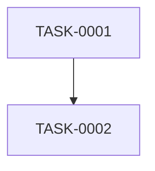

# rev-tasks

## 目的

既存のコードベースを分析し、実装されている機能を特定してタスク一覧として整理する。実装済みの機能から逆算してタスクの構造、依存関係、実装詳細を抽出し、文書化する。

## 前提条件

- 分析対象のコードベースが存在する
- `docs/tasks/` ディレクトリが存在する（なければ作成）
- TypeScript/JavaScript、Python、その他のコードを分析可能

## {要件名}の命名規則

コードベースを**機能単位**（feature単位）に分解し、各機能を{要件名}として出力する。

- 簡潔な英語に変換する
- ケバブケース（kebab-case）を使用
- 最大50文字程度に収める
- 例:
    - ユーザー認証 → "user-authentication"
    - 商品検索 → "product-search"
    - 注文管理 → "order-management"
    - 通知配信 → "notification-delivery"

### 出力ディレクトリ構造

各機能ごとに独立したディレクトリを作成する:

```
docs/tasks/
├── user-authentication/
│   ├── overview.md
│   ├── TASK-0001.md
│   └── TASK-0002.md
├── product-search/
│   ├── overview.md
│   ├── TASK-0001.md
│   └── TASK-0002.md
└── order-management/
    ├── overview.md
    └── TASK-0001.md
```

## 実行内容

1. **コードベースの構造分析**
   - ディレクトリ構造の把握
   - 設定ファイルの確認（package.json、tsconfig.json、requirements.txt等）
   - 依存関係の分析

2. **機能コンポーネントの特定**
   - フロントエンドコンポーネント
   - バックエンドサービス/コントローラー
   - データベース関連（モデル、マイグレーション）
   - ユーティリティ関数
   - ミドルウェア

3. **API エンドポイントの抽出**
   - REST API エンドポイント
   - GraphQL リゾルバー
   - WebSocket ハンドラー
   - ルーティング定義

4. **データベース構造の分析**
   - テーブル定義
   - リレーションシップ
   - マイグレーションファイル
   - インデックス設定

5. **UI/UX実装の分析**
   - 画面コンポーネント
   - 状態管理の実装
   - ルーティング
   - スタイリング手法

6. **テスト実装の確認**
   - 単体テストの存在
   - 統合テストの存在
   - E2Eテストの存在
   - テストカバレッジ

7. **機能の特定とタスクの逆算**
   - コードベースから機能を特定し、各機能を独立した{要件名}として分解
   - 各{要件名}内で実装された機能をタスクとして分解
   - タスクIDの自動割り当て（各{要件名}スコープ内で TASK-0001 から採番）
   - 依存関係の推定
   - 実装工数の推定

8. **ファイルの作成**
   - 各機能（{要件名}）ごとにディレクトリを作成
   - `docs/tasks/{要件名}/overview.md` として機能ごとのタスク一覧を保存
   - 各タスクを `docs/tasks/{要件名}/{TASK-ID}.md` として個別ファイルに保存

## 出力フォーマット例

### overview.md

````markdown
# {要件名} タスク一覧

## 概要

**分析日時**: {分析実行日時}
**対象コードベース**: {パス}
**発見タスク数**: {数}
**推定総工数**: {時間}

## タスク一覧

#### TASK-0001: {タスク名}

- [x] **タスク完了** (実装済み)
- **タスクタイプ**: {DIRECT|TDD}
- **実装ファイル**:
  - `{ファイルパス}`
- **実装詳細**:
  - {発見された内容}
- **推定工数**: {時間}

#### TASK-0002: {タスク名}

- [x] **タスク完了** (実装済み)
- **タスクタイプ**: {DIRECT|TDD}
- **実装ファイル**:
  - `{ファイルパス}`
- **実装詳細**:
  - {発見された内容}
- **テスト実装状況**:
  - [x] 単体テスト: `{テストファイル}`
  - [ ] E2Eテスト: 未実装
- **推定工数**: {時間}

## 依存関係マップ


````

### {TASK-ID}.md

```markdown
# {TASK-ID}: {タスク名}

## タスク概要

- **タスクタイプ**: {DIRECT|TDD}
- **推定工数**: {時間}
- **依存タスク**: {なし|TASK-XXXX}

## 実装ファイル

- `{ファイルパス}`

## 実装詳細

{発見された内容の詳細}

## テスト実装状況

- [ ] 単体テスト
- [ ] 統合テスト
- [ ] E2Eテスト
```

## 分析対象ファイルの自動検出

### フロントエンド

- React: `*.tsx`, `*.jsx`, `*.ts`, `*.js`
- Vue: `*.vue`, `*.ts`, `*.js`
- Angular: `*.component.ts`, `*.service.ts`, `*.module.ts`

### バックエンド

- Node.js: `*.ts`, `*.js` (Express, NestJS等)
- Python: `*.py` (Django, FastAPI等)
- Java: `*.java` (Spring Boot等)

### データベース

- SQL: `*.sql`, `migrations/*`
- ORM: モデルファイル、設定ファイル

### 設定ファイル

- `package.json`, `tsconfig.json`, `webpack.config.js`
- `requirements.txt`, `Pipfile`, `pyproject.toml`
- `pom.xml`, `build.gradle`

## 実行コマンド例

```bash
# カレントディレクトリを分析
claude code rev-tasks

# 特定ディレクトリを分析
claude code rev-tasks --path ./backend

# 特定の技術スタックに絞って分析
claude code rev-tasks --tech react,nodejs

# 詳細分析（テストカバレッジ等も含む）
claude code rev-tasks --detailed

# 出力形式指定
claude code rev-tasks --format json
```

## 実行後の確認

- 発見されたタスク数と推定工数を表示
- 実装済み/未実装の機能一覧を表示
- 技術的負債・改善推奨事項をサマリー表示
- 次のリバースエンジニアリングステップ（設計書生成等）を提案
